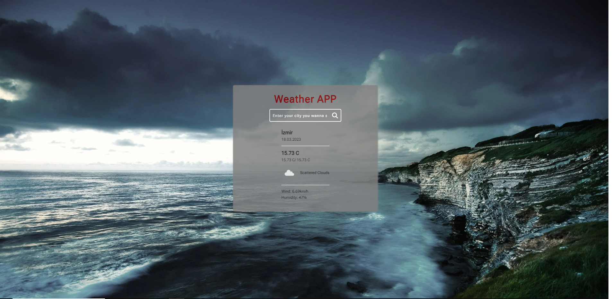

JavaScript API project for beginner

<ul>
<li>HTML5</li>
<li>CSS3</li>
<li>Vanilla JS for getting API</li>
<li>You can access this project by clicking <a href="https://fahriakbaba-weather-api-vanilla-js.netlify.app/" style="font-style: italic; color: gold;" tarhet="_blank">this link</a></li>
</ul>

